# Project Architecture & Overview

This repository uses a hybrid architecture blending **Astro's static site generation (SSG)** with **Svelte 5 "Islands"** for highly interactive, stateful UI components.

## Tech Stack

- **Framework:** [Astro](https://astro.build/) (Static Site Generation + Serverless API routes)
- **UI Components:** [Svelte 5](https://svelte.dev/)
- **Styling:** [Tailwind CSS v4](https://tailwindcss.com/)
- **AI Agent:** [Vercel AI SDK](https://sdk.vercel.ai/) (`@ai-sdk/svelte` & `@ai-sdk/google`)
- **Database (Vector & Redis):** [Upstash](https://upstash.com/) (Serverless Vector DB for RAG, Redis for Rate Limiting)
- **Testing:** Playwright (E2E) & Vitest (Unit)
- **Deployment:** Vercel

---

## Directory Map

```text
.
├── .github/workflows/    # CI/CD pipelines (Playwright, Lighthouse, Vitest, Formatting)
├── docs/                 # Project documentation (You are here)
├── scripts/              # Utility scripts (e.g. update-brain.ts for RAG embedding)
├── src/
│   ├── components/       # Svelte UI components (e.g., CommandDeck, ThemeToggle)
│   ├── content/          # Astro Content Collections (MDX case studies)
│   ├── data/             # Static JSON/TS data (Personal info, agent starters)
│   ├── layouts/          # Astro page wrappers (BaseLayout)
│   ├── lib/              # Shared utilities (prompts, formatting)
│   ├── pages/            # Astro routing (Pages and /api endpoints)
│   └── styles/           # Global CSS and Tailwind directives
└── tests/                # E2E and Unit testing files
```

---

## The Chatbot Pipeline (Deep Dive)

The site features a globally available "Command Deck" (invoked via `Ctrl+K` or a bottom floating bar) powered by a conversational AI agent. It is completely disconnected from standard page navigation, meaning it operates as an overlapping "Island" of interactivity.

### Architecture Diagram

```mermaid
sequenceDiagram
    participant User as User
    participant Deck as CommandDeck (Svelte)
    participant API as /api/chat (Astro API)
    participant DB as Upstash (Vector DB)
    participant LLM as Gemini (LLM)

    User->>Deck: Asks: "What is his tech stack?"
    Deck->>API: POST /api/chat { messages }

    Note over API: Rate limits via Upstash Redis

    API->>LLM: Stream messages + Tools

    rect rgb(30, 40, 50)
        Note over LLM, DB: RAG Tool Execution
        LLM->>API: call tool `query_jared_memory`
        API->>DB: Embed query, fetch top 3 vectors
        DB-->>API: Return factual chunks
        API-->>LLM: Inject facts into context
    end

    rect rgb(30, 50, 40)
        Note over LLM, Deck: Generative UI & Actions
        LLM->>Deck: stream response text
        LLM->>Deck: call tool `open_resume` (Triggers UI state)
    end

    Deck-->>User: Renders text + Executes UI Actions (e.g., opens PDF)
```



### 1. The Frontend (`CommandDeck.svelte`)

- Uses `@ai-sdk/svelte`'s `useChat` hook to manage the streaming state.
- Receives a stream of parts: some parts are text (which get rendered and linkified safely), and some parts are **Tool Calls**.
- **Generative UI:** When the LLM decides to trigger a frontend action (like panning the screen or changing the theme), it streams a tool call back to the client. The `onToolCall` callback in `CommandDeck.svelte` catches these and dispatches Svelte store updates (e.g., `setTheme('dark')` or `dispatchRoute('/projects/animo')`).

### 2. The Backend (`/api/chat.ts`)

- An Astro API route (Serverless function).
- **Security:** Protected by an Upstash Redis sliding-window rate limiter (10 requests / minute) to prevent LLM abuse. Payload size is strictly capped at 32KB.
- **Context Injection:** Before sending the payload to the LLM, the API fetches the slugs of all available case studies so the agent knows exactly what URLs exist on the site.

### 3. The Brain (RAG Tooling)

The model is equipped with a `query_jared_memory` tool. When a user asks a specific question about background, skills, or projects, the LLM _suspends its response_, invokes the tool, and the Astro API connects to the Upstash Vector Database. It searches for relevant chunks of text (embedded via `scripts/update-brain.ts`), injects them back into the LLM, and allows the LLM to generate a hallucination-free response based purely on the factual embeddings.

---

## Content Architecture (Astro)

The case studies (`/projects/*`) are generated statically at build time using Astro's Content Collections.

- Files live in `src/content/projects/*.mdx`.
- Frontmatter is strictly typed via `src/content.config.ts` using Zod schemas.
- If a required field (like `summary` or `stack`) is missing, the build will fail, ensuring perfect data integrity.

---

## Testing & CI/CD Pipeline

Every push and PR goes through a strict `npm run preflight` sequence defined in `.github/workflows/ci.yml`.

1. **Formatting & Linting:** Prettier and ESLint.
2. **Type Checking:** `astro check` ensures component props and content schemas are valid.
3. **Unit Tests:** `vitest` runs isolated logic checks.
4. **Build:** `astro build` pre-renders the site into `.vercel/output/static`.
5. **Lighthouse:** `lhci autorun` audits performance, accessibility, SEO, and best practices against the static build. A custom script (`scripts/lh-summary.mjs`) parses the output into a clean terminal summary.
6. **E2E Testing:** Playwright spins up a browser, mocks the AI API (so tests are deterministic and free), and clicks through the Command Deck and routing just like a real user.
