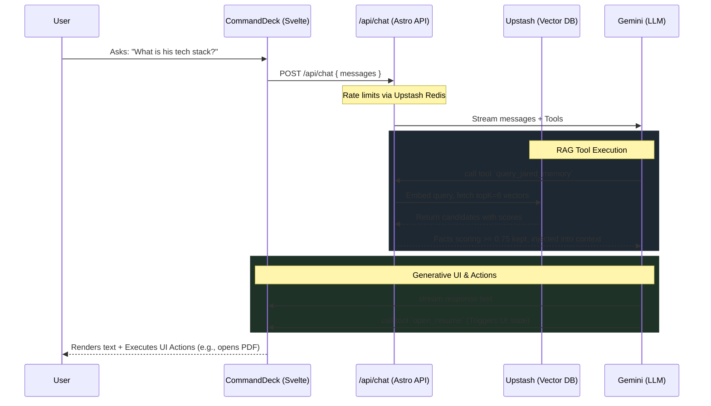

# Project Architecture & Overview

This repository uses a hybrid architecture blending **Astro's static site generation (SSG)** with **Svelte 5 "Islands"** for highly interactive, stateful UI components.

## Tech Stack

- **Framework:** [Astro](https://astro.build/) (Static Site Generation + Serverless API routes)
- **UI Components:** [Svelte 5](https://svelte.dev/)
- **Styling:** [Tailwind CSS v4](https://tailwindcss.com/)
- **AI Agent:** [Vercel AI SDK](https://sdk.vercel.ai/) (`@ai-sdk/svelte` & `@ai-sdk/google`)
- **Database (Vector & Redis):** [Upstash](https://upstash.com/) (Serverless Vector DB for RAG, Redis for Rate Limiting)
- **Testing:** Playwright (E2E) & Vitest (Unit)
- **Deployment:** Vercel

---

## Directory Map

```text
.
├── .github/workflows/    # 9 workflows: ci, eval, brain, mutation, visual, uptime,
│                         #   bundle-size, emergency-revert, heal-prompt
├── data/                 # Committed history JSON: eval-history/, lighthouse-history/,
│                         #   mutation-score.json — read by /status and README badges
├── docs/                 # Project documentation (You are here)
├── scripts/              # update-brain.ts (RAG sync), transform-eval-results.ts,
│                         #   lh-history.ts, mutation-summary.ts, ping-uptime.ts, ...
├── src/
│   ├── components/       # Svelte islands, grouped by role (agent/, chrome/, sections/, ui/)
│   ├── content/          # Astro Content Collections (MDX case studies)
│   ├── data/             # Static JSON/TS data (Personal info, agent starters)
│   ├── layouts/          # Astro page wrappers (BaseLayout)
│   ├── lib/              # Shared utilities (prompts, rag, shell/, formatting)
│   ├── pages/            # Astro routing — pages, /api endpoints, plus the
│   │                     #   /colophon, /status, /stats observability pages
│   └── styles/           # Global CSS and Tailwind directives
└── tests/                # e2e/, eval/, visual/ — separate Playwright configs
```

---

## The Chatbot Pipeline (Deep Dive)

The site features a globally available "Command Deck" (invoked via `Ctrl+K` or a bottom floating bar) powered by a conversational AI agent. It is completely disconnected from standard page navigation, meaning it operates as an overlapping "Island" of interactivity.

### Architecture Diagram


```mermaid
sequenceDiagram
    participant User as User
    participant Deck as CommandDeck (Svelte)
    participant API as /api/chat (Astro API)
    participant DB as Upstash (Vector DB)
    participant LLM as Gemini (LLM)

    User->>Deck: Asks: "What is his tech stack?"
    Deck->>API: POST /api/chat { messages }

    Note over API: Rate limits via Upstash Redis

    API->>LLM: Stream messages + Tools

    rect rgb(30, 40, 50)
        Note over LLM, DB: RAG Tool Execution
        LLM->>API: call tool `query_jared_memory`
        API->>DB: Embed query, fetch topK=6 vectors
        DB-->>API: Return candidates with scores
        API-->>LLM: Facts scoring >= 0.75 kept, injected into context
    end

    rect rgb(30, 50, 40)
        Note over LLM, Deck: Generative UI & Actions
        LLM->>Deck: stream response text
        LLM->>Deck: call tool `open_resume` (Triggers UI state)
    end

    Deck-->>User: Renders text + Executes UI Actions (e.g., opens PDF)
```

### 1. The Frontend (`CommandDeck.svelte`)

- **Shell-first:** typed input is tried against a client-side pseudo-shell (`src/lib/shell/` — lexer, executor, vfs, builtins) before ever reaching the LLM. Recognized commands (`home`, `theme`, `trace`, `cd`, `ls`, `cat`, ...) resolve instantly and offline; anything unrecognized falls through to the agent as free text. A separate `/`-prefixed command list provides the same actions with Ctrl+K-style discoverability.
- Uses the AI SDK's `Chat` class (`@ai-sdk/svelte`) to manage the streaming state — not the `useChat` hook.
- Receives a stream of parts: some parts are text (which get rendered and linkified safely), and some parts are **Tool Calls**.
- **Generative UI:** When the LLM decides to trigger a frontend action (like panning the screen or changing the theme), it streams a tool call back to the client. The `onToolCall` callback in `CommandDeck.svelte` catches these and dispatches Svelte store updates (e.g., `setTheme('dark')` or `dispatchRoute('/projects/animo')`).

### 2. The Backend (`/api/chat.ts`)

- An Astro API route (Serverless function), exposing six tools: `open_case_study`, `open_resume`, `focus_section`, `set_theme`, `trigger_ui_state`, `query_jared_memory`.
- **Security:** Protected by an Upstash Redis sliding-window rate limiter (10 requests / minute) to prevent LLM abuse. Payload size is strictly capped at 32KB.
- **Context Injection:** Before sending the payload to the LLM, the API fetches the slugs of all available case studies so the agent knows exactly what URLs exist on the site.

### 3. The Brain (RAG Tooling)

The model is equipped with a `query_jared_memory` tool. When a user asks a specific question about background, skills, or projects, the LLM _suspends its response_, invokes the tool, and the Astro API connects to the Upstash Vector Database. It queries topK=6 candidates and keeps only those scoring >= `RAG_MIN_SCORE` (0.75, see `src/lib/rag.ts`), injecting the survivors back into the LLM so it can generate a hallucination-free response based purely on the factual embeddings (from `scripts/update-brain.ts`). Kept facts render as footnote citations with their scores in the chat UI, and the full retrieval trace (kept + filtered-out candidates) is replayable via the `/trace` shell command.

---

## Content Architecture (Astro)

The case studies (`/projects/*`) are generated statically at build time using Astro's Content Collections.

- Files live in `src/content/projects/*.mdx`.
- Frontmatter is strictly typed via `src/content.config.ts` using Zod schemas.
- If a required field (like `summary` or `stack`) is missing, the build will fail, ensuring perfect data integrity.

---

## Testing & CI/CD Pipeline

Every push and PR runs `.github/workflows/ci.yml`, three jobs in parallel:

1. **static:** Prettier check, ESLint, `astro check`, `svelte-check`, Knip, Secretlint, then `astro build` (pre-renders to `.vercel/output/static`).
2. **unit:** `vitest run --coverage`, coverage report uploaded as a build artifact.
3. **lighthouse** (PR only): builds, then `lhci autorun` desktop + mobile against the build.

`npm run preflight` runs the same checks (plus `test:e2e`) locally in one command for full CI parity before a big push; see `docs/TESTING.md`.

The rest of the pipeline is split into single-purpose workflows (see the Directory Map above): `eval.yml` and `mutation.yml` run weekly and commit their history back to `data/`; `brain.yml` syncs the RAG vector store on every `my_facts.json` change; `visual.yml` compares screenshots on PRs and regenerates baselines on demand; `uptime.yml` pings production hourly; `bundle-size.yml` diffs bundle bytes on PRs.
